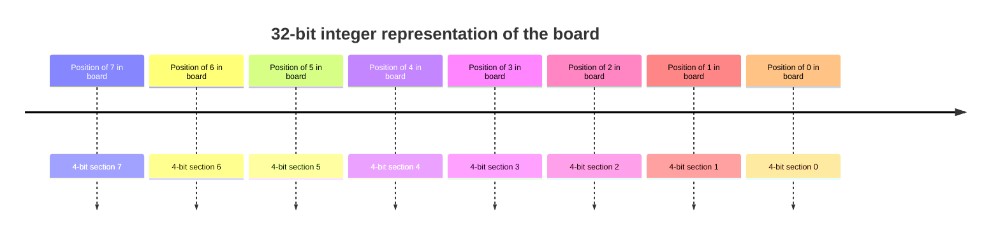
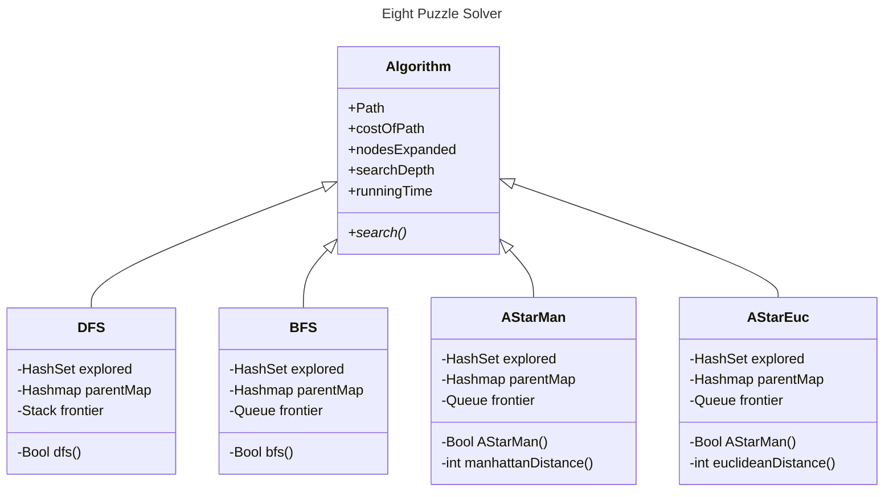

# Eight Puzzle Solver Using C++, SFML

## Introduction:

Given an initial state of the board, the problem is to find a sequence of moves that transitions this state to the goal
state;
that is, the configuration with all tiles arranged in ascending order
$0, 1, 2, 3, 4, 5, 6, 7, 8$ using search algorithms BFS, DFS, and A-Star with Manhattan and Euclidean as heuristic
functions.

|   | 1 | 2 |
|---|---|---|
| 3 | 4 | 5 |
| 6 | 7 | 8 |

## Demo:
https://github.com/el-sharif-mohamed22/Eight_Puzzle_Solver_C/assets/95565086/9d424c75-5bcb-4349-8cf3-44c89b551126

### How to run:

1. Enter the state from the keyboard as one string without spaces, and append it with a letter from:
    1. d, for DFS.
    2. b for BFS.
    3. e for A* using euclidean heuristic.
    4. m, for A* using manhattan heuristic
2. Click the button `Start Search`.
3. Use arrows `left` & `right` arrow for navigation between states.
4. Use `backspace` to remove the current state and put another one.

## State representation:

To maximize utilization of performance, the state of the board ($3 * 3$ grid) is represented using an 32-bit integer.
The 32-bit integer is divided into eight 4-bit sections, each section represents where the number is in the board.

> Note: The number 8 wasn't stored in the 32-bit integer because it is not needed to represent the state of the board.

### State Calculations:

* To get the position of zero in the board, the 32-bit integer is masked with `0xF`.
* Then the neighboring positions are calculated and become targets.
* The target is then swapped with the position of zero in the board.
* This operation takes at most $4$ operations for searching where is the targets in the integer.
* Time complexity is $O(1)$.

## Used Date Structures:

Table of data structures used in the project.

| Data Structure        | Description                                                                                                  |
|-----------------------|--------------------------------------------------------------------------------------------------------------|
| `std::vector`         | It was mainly used in the implementation. It was used to store state grid, neighbors data, and path to goal. |
| `std::unordered_set`  | Used to store the nodes in the explored set.                                                                 |
| `std::unordered_map`  | Used to store the parent of the node.                                                                        |
| `std::queue`          | Used as the frontier in BFS.                                                                                 |
| `std::stack`          | Used as the frontier in DFS.                                                                                 |
| `std::priority_queue` | Used to store the nodes in the frontier for A* algorithm.                                                    |

## Used Algorithms:

| Algorithm | Description                                                                                                                                                                                                                                                                                        |
|-----------|----------------------------------------------------------------------------------------------------------------------------------------------------------------------------------------------------------------------------------------------------------------------------------------------------|
| BFS       | It explores the states by visiting the shallowest nodes in the graph. It depends on FIFO for expanding the nodes and uses a queue for its implementation.                                                                                                                                          |
| DFS       | It explores the states by visiting the deepest nodes in the graph. It depends on LIFO for expanding and uses stack for its implementation.                                                                                                                                                         |
| A*        | It explores the states by visiting the lowest cost nodes in the graph and gets the shortest path to the goal using a heuristic function to get an estimation to the goal. It uses priority queue for its implementations. And for the heuristics it uses Manhattan and Euclidean for calculations. |

## Heuristic Functions:

### Theoretically:

| Manhattan Distance                                                                                                                        | Euclidean Distance                                                                                                                                |
|-------------------------------------------------------------------------------------------------------------------------------------------|---------------------------------------------------------------------------------------------------------------------------------------------------|
| It is the sum of absolute values of differences in the goal’s x and y coordinates and the current cell’s x and y coordinates respectively | It is the distance between the current cell and the goal cell using the distance formula.$h = \sqrt{(cell.x - goal.x)^2 + (cell.y - goal:y)^2 }$. |
| Simple to calculate and efficient for grid-based environments.                                                                            | More computationally expensive than Manhattan distance.                                                                                           |
| Admissible for grid-based environments( never overestimates true cost but it may do in non-grid-based environments).                      | Admissible as it gets a more accurate estimation of true cost in open spaces.                                                                     |

### Practically: on average run of 500 permutations.

|                | Manhattan Distance | Euclidean Distance |
|----------------|--------------------|--------------------|
| Nodes Expanded | 1391.3             | 2079.17            |
| Cost of path   | 21.6957            | 21.6957            |
| Search depth   | 21.6957            | 21.6957            |
| Running time   | 2.88933            | 5.41897 ms         |

> Note that Manhattan Distance is more admissible.

## Tie breaking policy:

* Tie breaking policy, neighbors investigating order when a tie:
    * Up.
    * Down.
    * Left.
    * Right.
* For DFS the neighbors are reversed because stack is LIFO.
* For the A* algorithm when nodes have equal cost then it depends on the `priority queue` how it does sort the states.

## Class Diagrams:

## Optimizations:

* Used 32-bit integer for state representation, and bitwise operations.
* Neighbors are precomputed for every zero position, leads to $O(1)$.
* Used the `parent-map` (search tree) to find out if the state is in the `frontier` in $O(1)$.
* `Maximum Depth Search` is calculated within the frontier instead of iterating the whole search tree.
* The omission of storing the eight position in the state, this led to a problem of calculating it.
    * But the usage of the addition to find its position while calculating the differences in the other positions. Led
      to the same complexity as if we stored it.
* Used unit testing to test optimized manhattan distance functions.